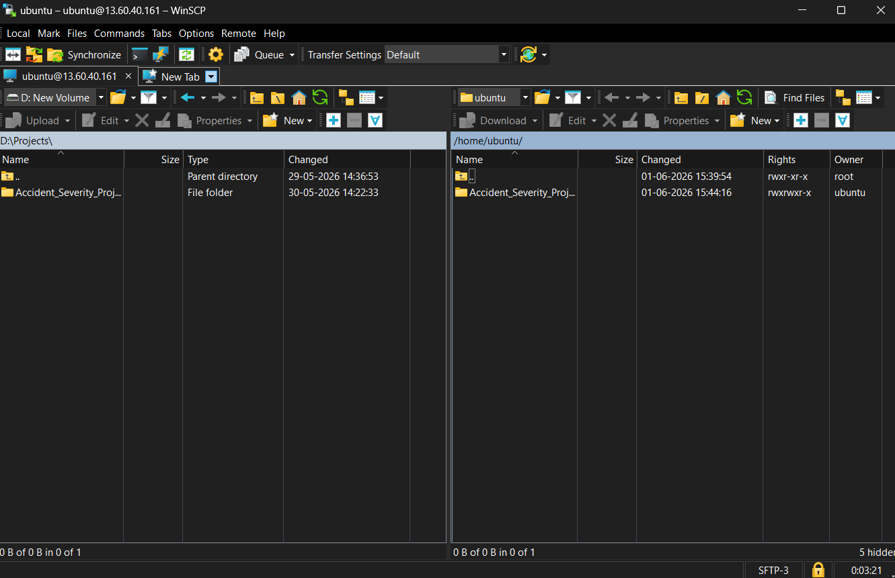
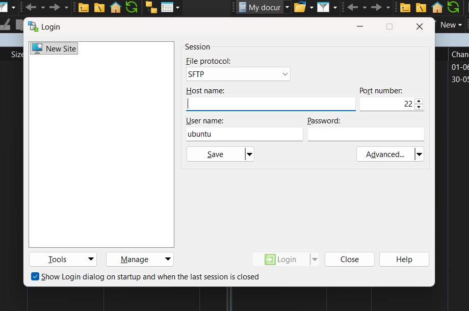
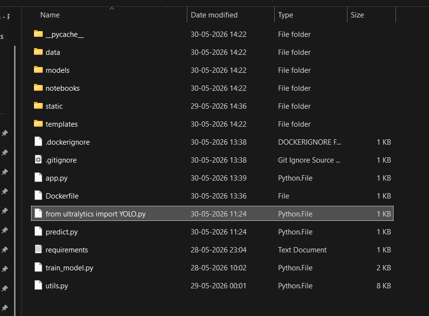
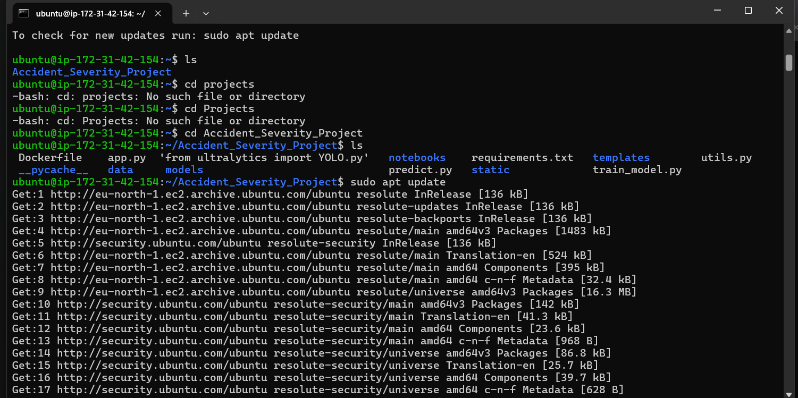
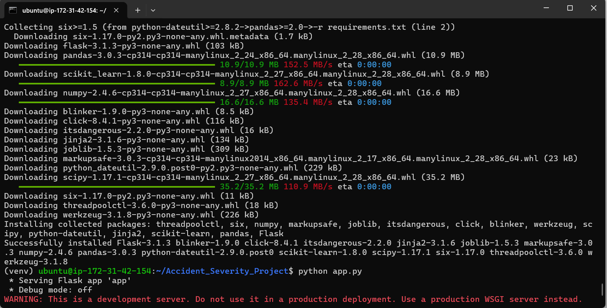
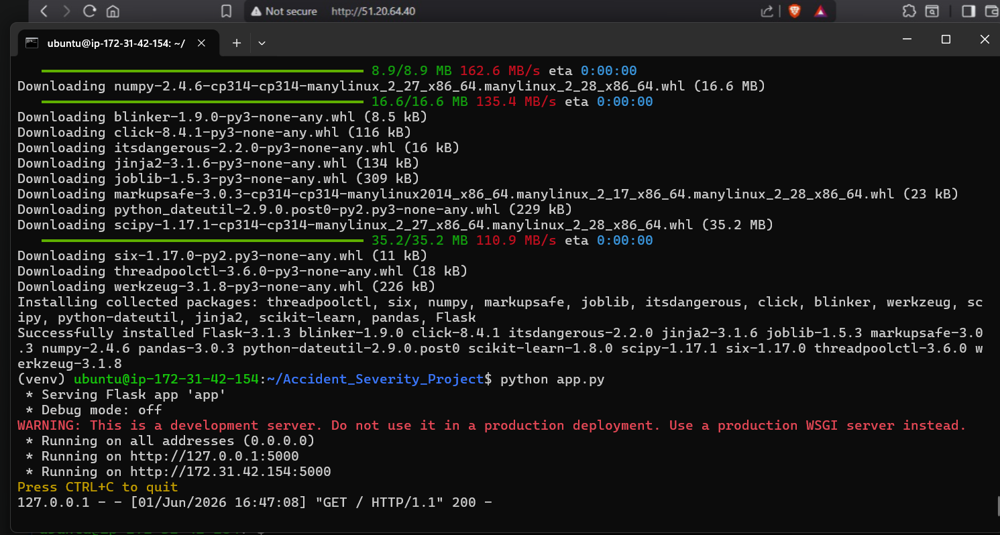
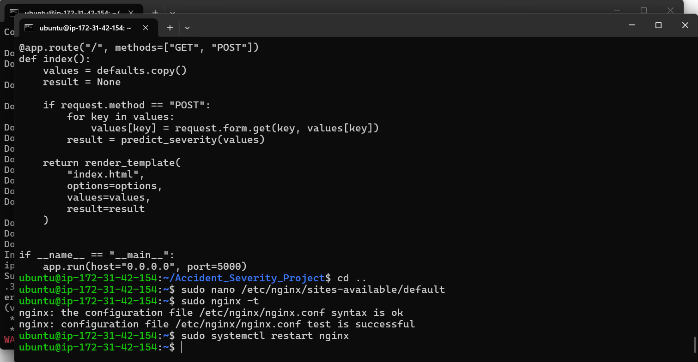
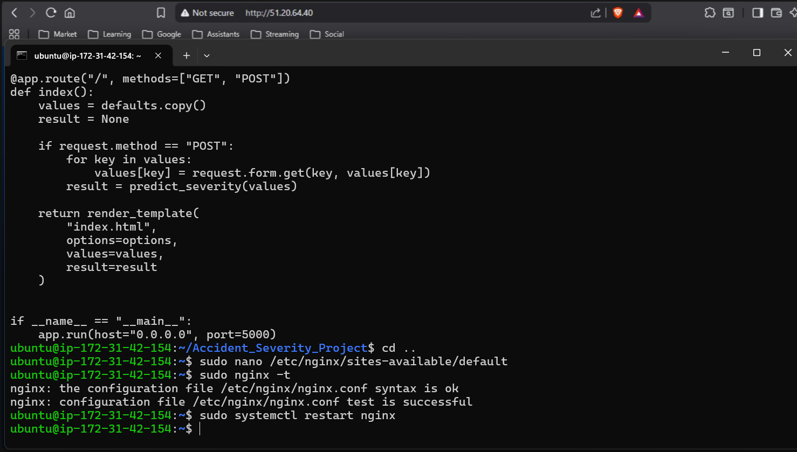
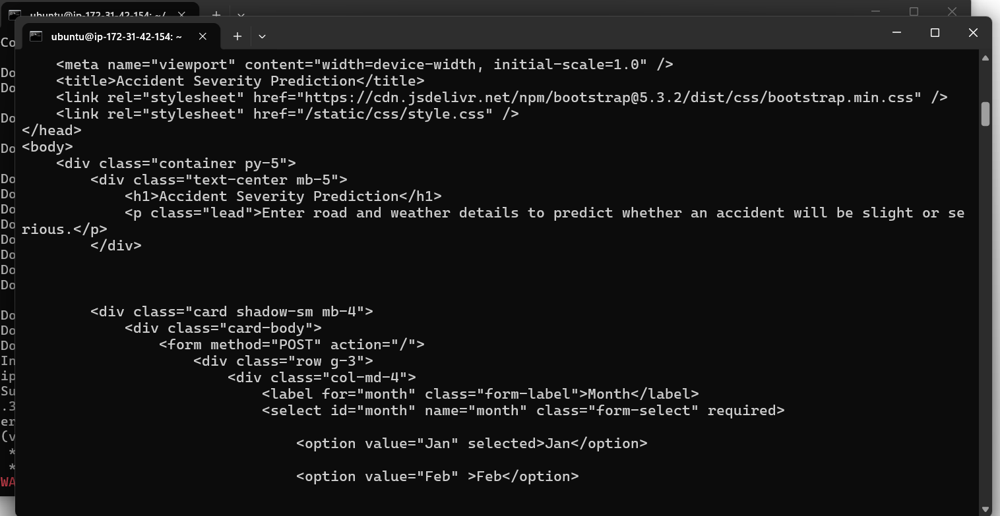
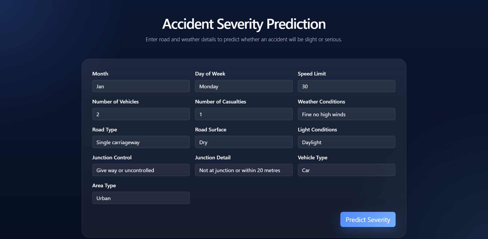

# Hosted Accident Severity Prediction Application on AWS EC2

## Step 1: Connect to EC2 using WinSCP

## Step 2: Login to EC2 Instance using SSH

## Step 3: Verify Project Files on EC2

## Step 4: Update Ubuntu Packages

## Step 5: Install Project Requirements

## Step 6: Run the Flask Application

## Step 7: Configure Nginx Reverse Proxy

## Step 8: Validate and Restart Nginx

## Step 9: Verify Generated HTML Output

## Step 10: Access Application Through Public IP

## Result

Successfully deployed the Accident Severity Prediction Flask application on AWS EC2 and made it accessible through the public IP address using Nginx.